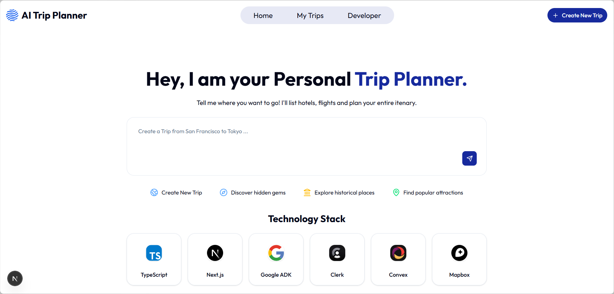
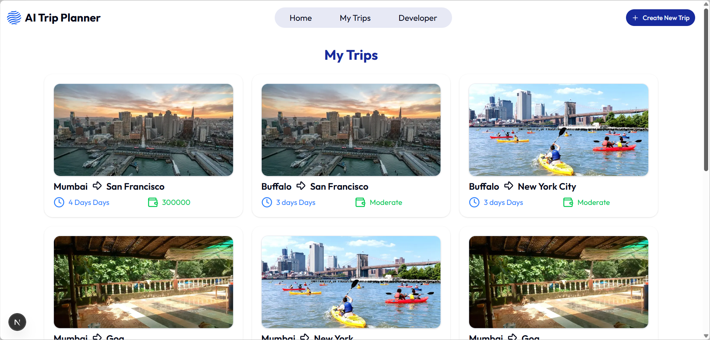
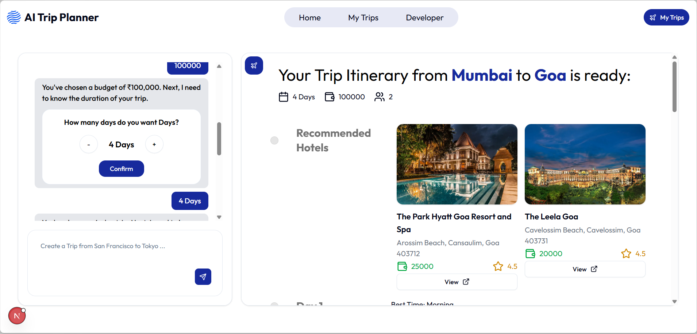
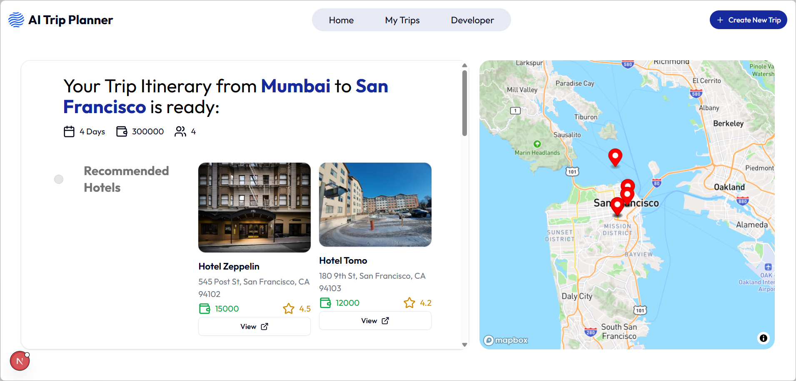
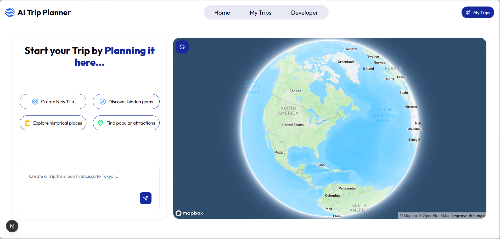
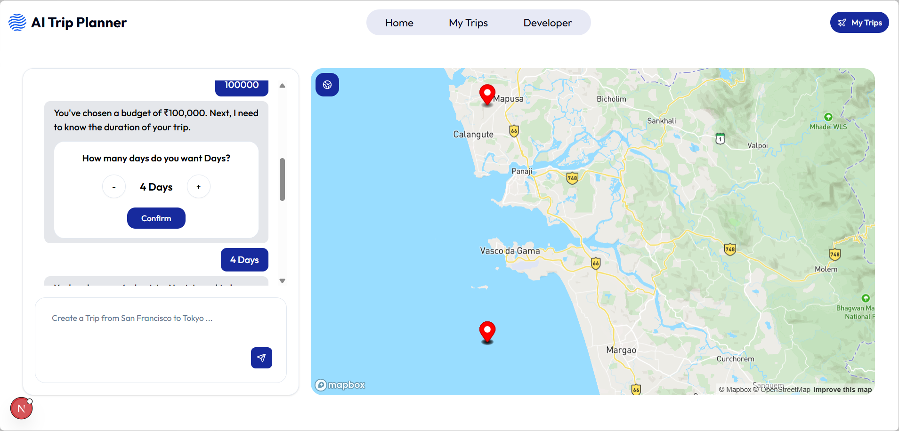

# MCP Server for Trip Planning Agent
<table>
  <tr>
    <td>
      
    </td>
    <td>
      
    </td>
    <td>
      
    </td>
    <td>
      
    </td>
  </tr>
</table>

## Preview

<table>
  <tr>
    <td></td>
    <td></td>
    <td></td>
  </tr>
  <tr>
    <td></td>
    <td></td>
    <td></td>
  </tr>
</table>

## Description

#### Developed an MCP server using Google ADK for Trip Planning Agent. Created a fullstack application using Typescript-Next.js for generating and displaying itinerary. Used Convex for relational database, Clerk for authentication and Mapbox for displaying map.